  

  <a href="#sobre-mim">Sobre</a> ·
  <a href="#projetos-em-destaque">Projetos</a> ·
  <a href="#stack">Stack</a> ·
  <a href="#contato">Contato</a>

## Sobre mim

Olá, eu sou **Rafael Andrade Tanimoto** 👋

Desenvolvo **APIs com Java e Spring Boot**, aplicações **Android** e ferramentas **desktop**. Gosto de conectar o que acontece nos bastidores — filas, dados e integrações — a interfaces fáceis de usar.

Minha base em **Design Digital** acompanha esse trabalho: clareza na interface e cuidado com a experiência de quem usa.

🎓 Análise e Desenvolvimento de Sistemas — **FIAP** · 📍 **Brasil**

- **Backend:** processamento assíncrono, rastreabilidade e tratamento de falhas.
- **Mobile:** dados locais e experiências que funcionam sem depender de uma conta.
- **Ferramentas:** automação e integração entre aplicações desktop e Android.

## Projetos em destaque

<table>
  <tr>
    <td width="50%">
      <h3><a href="https://github.com/Famel-svg/SafePix_Async">SafePix Async</a></h3>
      
API que recebe solicitações Pix por HTTP e as processa em segundo plano com RabbitMQ. Explora idempotência, rastreabilidade e tratamento de falhas com DLQ.

      Java 21 · Spring Boot · RabbitMQ · Docker
      
<a href="https://github.com/Famel-svg/SafePix_Async#arquitetura">Ver arquitetura →</a>

    </td>
    <td width="50%">
      <h3><a href="https://github.com/Famel-svg/repforge">RepForge</a></h3>
      
Aplicativo Android para montar fichas de treino, registrar cargas e acompanhar a evolução. Dados no aparelho, com exportação e importação em JSON.

      Expo · React Native · TypeScript · SQLite
      
<a href="https://github.com/Famel-svg/repforge#screenshots">Ver telas →</a>

    </td>
  </tr>
  <tr>
    <td colspan="2">
      <h3><a href="https://github.com/Famel-svg/apk-preview-desktop">APK Preview Desktop</a></h3>
      
Ferramenta Windows para instalar, executar e inspecionar APKs no Android Emulator oficial. A interface desktop e as ferramentas MCP controlam a mesma sessão.

      Python · PySide6 · Android Emulator · MCP
      
<a href="https://github.com/Famel-svg/apk-preview-desktop#recursos">Explorar recursos →</a>

    </td>
  </tr>
</table>

<a href="https://github.com/Famel-svg?tab=repositories">Explorar todos os repositórios →</a>

## Stack

| Área | Tecnologias |
| :--- | :--- |
| Backend | Java · Spring Boot · RabbitMQ |
| Android e mobile | Kotlin · Android · Expo · React Native · TypeScript · SQLite |
| Desktop e integração | Python · PySide6 · MCP |
| Ambiente de desenvolvimento | Docker · Git · GitHub |

  
  
  
  
  
  
  
  

<!-- Referências de composição: anuraghazra/anuraghazra e o artigo de Avi Vashishta
https://www.avivashishta.com/blog/build-animated-github-profile-readme
O cabeçalho é um SVG local; a apresentação principal também está disponível em texto. -->

## Contribuições

  

Dados do calendário público do GitHub · Atualização diária 
  <a href="https://github.com/Famel-svg/Famel-svg/actions/workflows/update-contributions.yml">Acompanhar atualização</a> ·
  <a href="https://github.com/Famel-svg?tab=overview">Ver atividade no GitHub</a>

## Contato

  
  

